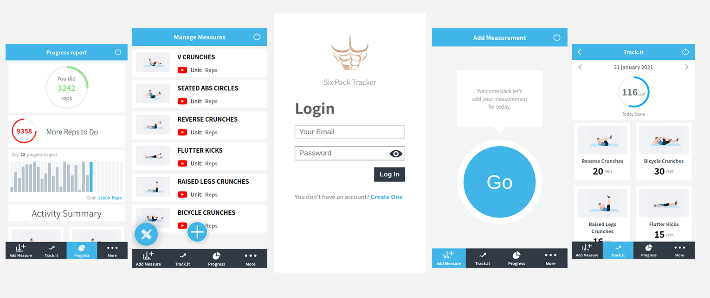

* # Six Pack Tracker(Back End)

  **This is the final capstone project required by [Microverse](https://www.microverse.org/). After finishing the whole program, they have picked this project for me to prove my technical knowledge in React/Redux and Ruby on Rails, you can find the requirement [here](https://www.notion.so/Final-Capstone-Project-Tracking-App-22e454da738c46efaf17721826841772#2710d5572c59407c90bef34f3cbf53e3)**

  > Six Pack Tracker is a 30 days workout app challenge. that, challenges the users to do a certain type of ABS exercises for 30 days, with a repetitions goal for every move in every day. This app also shows to the users their progress to motivate them to do more. You should also not that the app is not responsive for Desktop, you can open it only on mobile or tablet. This repository is the backend part of the app cause it's a Full Stack Application built using React/Redux and Ruby on Rails. You can find the frontend repository [here](https://github.com/elmejdki/sixpack-tracker-api).

  ## Project Preview:

  

  ## Built With

  - Ruby;
  - Rails;
  - AWS S3 v1.71.1;
  - JWT;
  - Bcrypt;
  - PostgreSQL 1.2.3;
  - shoulda-matchers;
  - Rspec.

  ## Live Demo

  [Live Demo Link](https://sixpacktracker.herokuapp.com/)

  ## Getting Started

  ### Prerequisites

  Ruby v2.7.2, Rails v6.1.1, Postgres: >=9.5

  ### Setup

  install gems with

  ```
  bundle install
  ```

  Setup database with:

  ```
  rails db:create
  rails db:migrate
  ```

  

  ## IMPORTANT

  **I used the S3 AWS service in order to store images. Therefore, I used SECRET KEYS stored in environment variables on my development and production servers.**

  - So if you have AWS credentials create a file named `application.yml` inside `config/`, then past in your credentials like showing bellow:

  ```ruby
    development:
      access_key_id: your_access_key_id_goes_here
      secret_access_key: your_secrect_access_key_goes_here
  ```

  ### Run Tests

  To run tests you can easily go to the root of the project and then run the following command:

  ```
  rspec
  ```

  You can also add your own test cases on the `/spec` directory.

  ### Usage

  Start server with:

  ```
  rails s
  ```

  Then open `http://localhost:3000/` in your browser

  ## Authors

  👤 **Zakariae El Mejdki**

  - Github: [@elmejdki](https://github.com/elmejdki)
  - Twitter: [@zakariae_elmejdki](https://twitter.com/zakariaemejdki)
  - Linkedin: [Zakariae El Mejdki](https://www.linkedin.com/in/zakariaeelmejdki/)

  ## 🤝 Contributing

  Contributions, issues and feature requests are welcome!

  Feel free to check the [issues page](https://github.com/elmejdki/sixpack-tracker-api/issues).

  ## Show your support

  Give a ⭐️ if you like this project!

  ## 📝 License

  This project is [MIT](lic.url) licensed.
